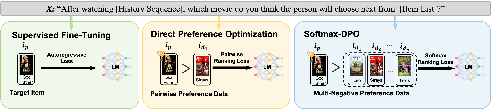

<div align=center>
<!-- <h1>Avatar: Agent-based Virtual Approach to Large Scale Recommendation Simulation</h1> -->

<h1>On Softmax Direct Preference Optimization for Recommendation</h1>




Recommender systems aim to predict personalized rankings based on user preference data. With the rise of Language Models (LMs), LM-based recommenders have been widely explored due to their extensive world knowledge and powerful reasoning abilities. Most of the LM-based recommenders convert historical interactions into language prompts, pairing with a positive item as the target response and fine-tuning LM with a language modeling loss. However, the current objective fails to fully leverage preference data and is not optimized for personalized ranking tasks, which hinders the performance of LM-based recommenders. Inspired by the current advancement of Direct Preference Optimization (DPO) in human preference alignment and the success of softmax loss in recommendations, we propose Softmax-DPO (S-DPO) to instill ranking information into the LM to help LM-based recommenders distinguish preferred items from negatives, rather than solely focusing on positives. Specifically, we incorporate multiple negatives in user preference data and devise an alternative version of DPO loss tailored for LM-based recommenders, connected to softmax sampling strategies. Theoretically, we bridge S-DPO with the softmax loss over negative sampling and find that it has a side effect of mining hard negatives, which assures its exceptional capabilities in recommendation tasks. Empirically, extensive experiments conducted on three real-world datasets demonstrate the superiority of S-DPO to effectively model user preference and further boost recommendation performance while mitigating the data likelihood decline issue of DPO.

</div>

<p id="Catalogue"></p>  

## 📋 Catalogue 

- [Catalogue](#Catalogue)
- [Preparations](#Preparations)
- [Quick Start](#Quick-Start)

<p id="Preparations"></p>  

## ⚙️ Preparations

### Step 1. Install requirements.txt
Set up a virtualenv and install the [pytorch](https://pytorch.org/get-started/previous-versions/) manually. After that, install all the dependencies listed in the `requirements.txt` file by running the following command:

```bash
pip install -r requirements.txt
```
Our experiments have been tested on **Python 3.9.7 with PyTorch 2.2.2+cu117**.


<p id="Quick-Start"></p> 

## ⌛️ Quick Start

We provide a sample data of **LastFM** in ./data folder. Further processing can refer to data_interface.py.

By running the following command, you will start run **Supervised Fine-Tuning** on language model based recommenders.
```bash
bash sft.sh
```

By running the following command, you will start run **Direct Preference Optimization** on language model based recommenders.
```bash
bash dpo.sh
```

By running the following command, you will start run **Softmax Direct Preference Optimization** on language model based recommenders.
```bash
bash softmax_dpo.sh
```

By running the following command, you will start run **Inference** to get the performance metrics.
```bash
bash inference.sh
```
